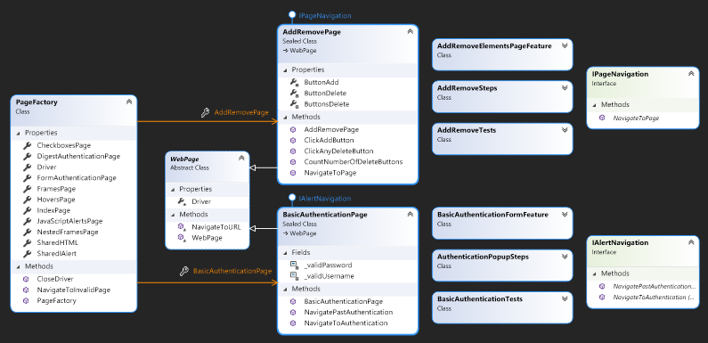

# Selenium-Herokuapp-Framework

Repository featuring a C# .NET Core Selenium automated testing framework that has been designed to test the http://the-internet.herokuapp.com website. This website under test, or otherwise more generally referred to as the system under test (SUT), has been selected for featuring a healthy selection of pages that have been deliberately designed to [capture prominent and ugly functionality found on the web](https://github.com/saucelabs/the-internet). The framework supports the execution of regular automated tests and Behaviour-Driven Development (BDD) tests in the Google Chrome and Mozilla Firefox web browsers.

## Framework Design

### Class Diagram

### Page Object Model

The framework has been designed with conformity to the Page Object Model (POM), a commonly used design pattern when forming Selenium automated tests. It consists of a central object repository to model the SUT where each tested page is assigned to its own class. These page objects hold `private` properties to correspond to the many web elements of the page, and `public` methods to describe how an end user is expected to interact with a given element. This design allows for pages to be modified in isolation without concern for affecting the other components of the system.

Ultimately speaking, the POM provides a modular framework that reduces code duplication whilst also strengthening desirable system aspects such as readability, scalability, and extensibility. It should be noted that C# was [previously packaged with a PageFactory class that has since been depreciated and replaced by C# properties](https://alexanderontesting.com/2018/05/21/c-and-the-disappearing-pagefactory-my-next-steps-in-selenium-testing/). Henceforth, a custom `PageFactory.cs` class has been created to serve as the central object repository for the framework. Additionally, the Selenium WebDriver tool that is required to automate web testing is created in this repository as a customisable `IWebDriver` property that can be further configured in the `DriverConfig.cs` class.

### Inheritance

All visitable pages of the SUT inherit from the abstract `WebPage.cs` class. It consists of `protected` attributes to form a template that stores and defines the common features shared across all visitable pages. This class holds a critical read-only `IWebDriver` property that is shared to its derived pages through the use of its constructor. This design decision not only reduces the need to repeatedly create `IWebDriver` definitions in derived pages, but it also optimises test execution time by ensuring that these pages can only ever rely on a single instance of an `IWebDriver` at any given time. Lastly, the class holds a simple `NavigateToUrl()` method to standardise the methodology in which the pages are accessed via url navigation.

### Composition

All visitable pages of the SUT implement an interface of either `IAlertNagivation.cs` or `IPageNavigation.cs`. Both interfaces hold methods which serve as wrappers for the inherited `NavigateToUrl()` method. The `IAlertNavigation` interface is applied to any visitable pages whose access is blocked by an authentication alert, and the `IPageNavigation` is used for all the other visitable pages. Ideally, a single `IPageNavigation` interface should ever be used for the framework, but there is currently an issue with authentication alerts where keyboard information can not be directly passed into the authentication fields of the alert pop-up. Having identified this, the `IAlertNavigation` interface serves to mimic page navigation behaviours for instances where a simple url string is insufficient.

### Drivers

The type of the Selenium WebDriver used in the framework can be globally controlled in the `StaticDriver.cs` class. The class holds private fields corresponding to the two currently supported types of web drivers (`ChromeDriver` for Google Chrome and `FirefoxDriver` for Mozilla FireFox) and a read-only `Type` property that determines the driver type to be executed against when running the automated tests. The `Type` property is set to use the Chrome driver by default and this can be modified to instead use the Firefox driver by changing the property's assignment field. The `PageFactory.cs` class deliberatly does not specify a default value for the `IWebDriver` to be passed into the `DriverConfig.cs` class to ensure that the assignment of the `IWebDriver` can only exist from a single source.

## Testing

Comparison

### Regular tests

- Faster to construct
- Faster to run
- Less readable

### BDD tests

- Feature and step files
- Slower to construct
- Slower to run
- Reusability of steps
- More readable (Gherkin)

### General

`IAlert` authentication access issues
- `ChromeDriver` cannot interact with elements
- `FirefoxDriver` can `Accept()` `Dismiss()` but cannot send string information
- Bypass by directly sending credentials via url string
- `MiscellaneousTests.cs` exclusive to regular tests

## Extending the framework

More pages of sut
Navigation to page
1. Add property to `IndexPage.cs`
2. Add method to `IndexPage.cs`
3. Add IndexPage test to validate page navigation

POM page class setup
1. Add key-value pair to `Testhost.dll.config`
2. Add `static readonly string` property to `ConfigReader.cs`
3. Create a class to represent page in the Pages folder
4. Inherit from `WebPage.cs` and implement either the `IPageNavigation.cs` or `IAlertNavigation.cs` interface
5. Add property to `PageFactory.cs` to reference created class
6. Add property assignment in constructor of `PageFactory.cs` to pass driver to class
7. Reference class in tests using `PageFactory.newPageClass.methods()`

`Static Driver.cs` to switch between drivers
`DriverConfig.cs` to extend common driver configuration

Compatibility for different browsers outside of Chrome and Firefox
